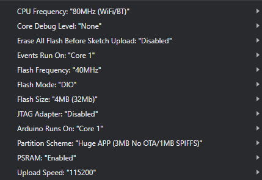

# Table of contents

1. [Overview](#Overview)
2. [Configuration](#Configuration)
2. [Uploading code](#uploading-code)
    1. [Wiring up the camera for uploading](#wiring-up-the-camera-for-uploading)
    2. [Setting up the environment](#setting-up-the-environment)
    3. [Compiling and uploading the code](#compiling-and-uploading-the-code)
3. [Running the code](#running-the-code)
4. [Connecting the camera](#connecting-the-camera)

## Overview

This subdirectory contains the code for the camera. The camera module we use for this project is the ESP32-CAM. 
It's a SoC, meaning that it runs its own code. In order to upload the code you need to connect it 
to a computer through a microcontroller or a serial adapter. Once the code is uploaded, all it needs 
to operate is a power source.

This codebase is currently based on the CameraWebServer example code for esp32. It provides a simple 
web server with a video stream, and endpoint to control settings such as camera resolution etc. 

## Configuration

For now, configuring the wi-fi credentials and MQTT broker address manually is necessary. 
Open config.h and enter your credentials along with the address.

## Uploading code

There are several versions of the camera module. These steps are particular to the one we have 
on hand, some details may vary.

### Wiring up the camera for uploading

For this step, you'll need a microcontroller, or a serial adapter. 

1. Connect `GPIO 0` to ground. This will put the module into flashing mode.
2. Connect `GPIO 1` to TX and `GPIO 3` to RX, these are the serial pins of the module. Keep in mind 
that these are reversed when running the code, for the serial connection with the cars Arduino
3. Connect 5V and ground accordingly.

See [this link](https://randomnerdtutorials.com/esp32-cam-ai-thinker-pinout/) for the pinout diagram
and further details.

### Setting up the environment

1. Open the Arduino IDE, and under File -> Preferences (Arduino IDE -> Preferences on mac), add
`https://raw.githubusercontent.com/espressif/arduino-esp32/gh-pages/package_esp32_index.json` to 
"Additional boards manager URLs"
2. Under Tools -> Board -> Board Manager, search for "esp32" and install the latest version.
3. In arduino IDE, under tools select the "ESP32 Dev Module" board. 
4. Include these libraries, found in the repository's `lib/` directory
   - pubsubclient-2.8.zip
   - SerialTransfer-3.1.3.zip

For the specific settings, see screenshot bellow. Some of these can be tweaked.

With everything connected and set up, open the serial monitor with baud rate set to 115200 and press
the reset button on the camera module. It should output `waiting for download`, which means it's all
set up to upload the code.

### Compiling and uploading the code

Open the project in Aurdino IDE and simply press Upload. If there are issues at this step, you may need
to tweak the settings under the Tools menu, or restart the module using the button on the back side.

## Running the code

Once uploaded, disconnect `GPIO 0` from ground and **switch the RX and TX pins around**.
Press the reset button to restart the module in run mode.

## Connecting the camera

To connect the camera feed, ~~you can look at the serial output of the module, where it will output its
own address~~. Through that address, the stream, endpoints and web ui are accessible.
In the future, we could add functionality to auto discover the ip address instead for a more seamless
setup experience (maybe a pairing setup wizzard on the app?)
