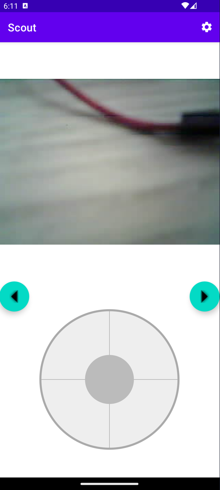
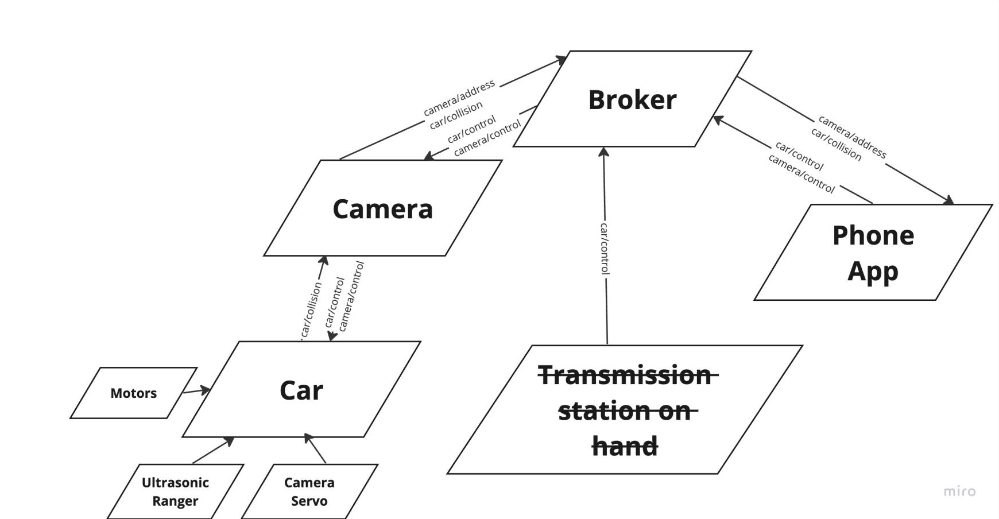
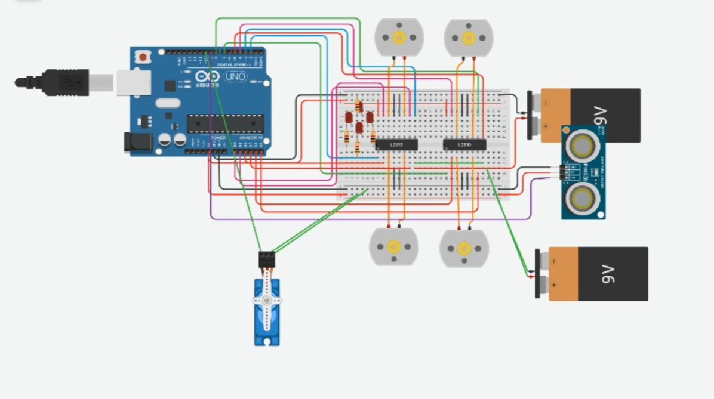

# Hand-gesture controlled mini-car
-------------------------

A project to develope a  hand-gesture-controlled car with a mobile app interface
## Installation

1. Setup the car by uploading the following file onto the arduino controlling the car: "Car/Car.ino". Flashing the file can be done using arduino IDE [IDE Download-And-Install guide](https://support.arduino.cc/hc/en-us/articles/360019833020-Download-and-install-Arduino-IDE). Documentation to help with uploading the file after you have the IDE installed: [How to upload a sketch in Arduino IDE](https://support.arduino.cc/hc/en-us/articles/4733418441116-Upload-a-sketch-in-Arduino-IDE).
2. Setup the camera following the [README in the Camera subdirectory](Camera/README.MD).
3. Setup the phone application by following standard procedure for Andriod app downloads ([downloanding apps for an Android phone](https://support.google.com/android/answer/9457058?hl=en)). The application is called group 7 SCOUT.

## Video Demo

### Control the car by a self-created mobile app and car detects collision

The link to the video demo is [here](https://www.youtube.com/watch?v=LsxHzzjNhcY&ab_channel=Team7).

# Other videos of the car's progression and testing can be found in [HERE](https://drive.google.com/file/d/1bAKY2Shkt4XTwdzXonhrB6Md_Ur7gF41/view?usp=sharing)  or [HERE](https://drive.google.com/file/d/1bAKY2Shkt4XTwdzXonhrB6Md_Ur7gF41/view?usp=drive_link)

## Controls

- **How to control the car using a phone**

The following image displays how the application's main page looks like.

The thumbstick can be used to steer and accelerate. Meanwhile the purple buttons on the sides of the camera-view can be used to rotate the servo which the camera is mounted on. Lastly, the cogwheel at the top-right is used to access a settings page. This page contains a toggle for hiding the controller, but also advanced mqtt and network options.

- **How to control the car using the hand-transmitter**

To control the car the user must turn the hand-transmitter in the direction they would like to steer. To accelerate, the user must rotate the hand in the intended direction (forward, backward, right or left). Note that the hand transmitter must be held horisontally with the screen facing upward.

## Communication's Design

The design of the system's communication can be seen below.

The system's broker recives and sends messages to various sub-systems forming a greater system. The direction of arrows display who is sending the messages and who are reciving. As seen in the diagram, the camera is the component which is responsible for all of the car's comunication with the broker. Additional note, the transmition station on hand was part of the original requirements but was removed as it was out-of-scope, hence it is crossed out.

## Hardware Design

The image below is of a simulation of the car's hardware.

The components present are:
- 4 dc motors
- breadboard
- 1 servo motor
- 2 l298N motor drivers
- 1 arduino UNO
- 2 9V batteries
- ultrasonic ranger
- red LED
- 1 220 Ohm resistor

It is important to note the motors and the functionality of the [l298N](https://lastminuteengineers.com/l298n-dc-stepper-driver-arduino-tutorial/) driver modules. The driver modules are important to have a more advanced control over the motors, which is critical to achieve proper steering. Another note is that the servo and the ultrasonic ranger both wire to the arduino in a similar way. The color code of the wires is this: black is ground, pink is direction, green is speed, and red is power for the motor drivers.

## Purpose and Benefits

1. Can be used as a toy or game for entertainment and improvement of hand-eye coordination. 
2. Can be used as a tool to scope out hazardous enviornments.

